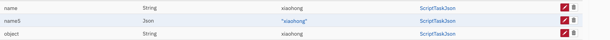

## 关于Camunda中的变量JSON序列化
> camunda官方文档：https://docs.camunda.org/manual/7.18/reference/spin/json/01-reading-json/
### 通过 camunda 提供的 Spin 进行 json 数据转换
在camunda运行中的流程变量，可以通过Spin将对应的字符类型转换为json格式的数据，典型应用：在使用`service task`完成http请求后，返回的response数据。
通过`connector.getVariable('response')`获取的数据类型为`String`  此时需要将json类型的字符转换成json数据。
```text
通过 connector.getVariable('response') 获取的 String 类型的返回值如下：
{"_id":{"timestamp":1668662538,"date":"2022-11-17T05:22:18.000+00:00"},"name":"xiaohong","age":19,"gender":"girl"}
```
- JavaScript

```javascript
var responseBody = connector.getVariable('response')
var jsonData = S(responseBody)
//获取当前 json 对象的 name,类型自动推断
// 如果单独使用 jsonData.prop("name") 则返回值为 json 类型的字符
var name = jsonData.prop("name").value()
```
- groovy
```groovy
def responseBody = connector.getVariable('response')
def jsonData = S(responseBody)
//获取当前对象的 age
// 如果单独使用 jsonData.prop("age") 则返回值为 json 类型的字符
def age = jsonData.prop("age").value()
```
### 在JavaScript 中通过 JSON 序列化
```javascript
//返回值类型为 Object -> com.oracle.truffle.polyglot.PolyglotMap
var jsonData = JSON.parse(responseBody)
//获取 name,此时可以通过对象的方式获取属性
var name = jsonData.name
```
### 在groovy 中通过 内置类 JSON 序列化
> groovy 官方文档：http://www.groovy-lang.org/processing-json.html
```groovy
import groovy.json.JsonSlurper
def jsonSlurper = new JsonSlurper()
// 此时返回值类型为 Object -> groovy.json.internal.LazyMap
def jsonData = jsonSlurper.parseText(responseBody)
//此时获取 name 可以通过对象.属性获取
def name = jsonData.name
```